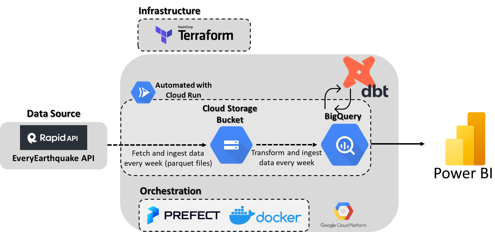

# DATA ENGINEERING ZOOMCAMP – Final Project
## Overview
This capstone project was developed as a part of the [Data Engineering Zoomcamp](https://github.com/DataTalksClub/data-engineering-zoomcamp) 
course held by [DataTalks.Club](https://datatalks.club/). 
The goal of this project was to build an end-to-end data pipeline, with a focus on: 
* Creating a data pipeline to aid with batch data processing (on a weekly basis);
* Producing an analytical dashboard that will allow to easily discover trends and assimilate insights.

> **Disclaimer** The dataset used for this project was collected between January and April 2023, which makes it a relatively small dataset (X observations). The main idea of this project wasn't to deal with a big dataset at this point, but rater build a pipeline that can fetch, organize and transform present data on a weekly basis. However, it is possible to obtain a bigger dataset if you maintain this pipeline to fetch data for longer time, but for me that wasn't possible due to course deadlines.

## Table of Contents
<details>
  <summary>Table of Contents</summary>
  <ol>
    <li>
      <a href="#about-the-project">About The Project</a>
      <ul>
        <li><a href="#dataset-used">Dataset used</a></li>
        <li><a href="#technologies">Technologies</a></li>
        <li><a href="#project-architecture">Project architecture</a></li>
      </ul>
      <a href="#dashboard">Dashboard</a>
      <ul>
      <a href="#conclusions">Conclusions</a>
      <ul>
      <a href="#reproducibility">Reproducibility</a>
      <ul>
      </ol>
</details>

## About the Project
The planet Earth is constantly changing 🌍. Seismic activity is produced when tectonic plates shift or when other events take place below the surface. While some earthquakes are sizable and do a lot of damage, other earthquakes are so little that they can hardly be felt without sensitive technology. 

Earthquake data is a valuable resource for public safety, and this project aims to look to this information at weekly basis. With the power of this data, we can answer a series of questions:
 - How many earthquakes happened worldwide per day? 
 - What is the average earthquake number per continent?
 - How many earthquakes happened near to populated zones? What was its magnitude?
 - Which geographical area had the most earthquakes per week? How many had magnitude higher than 5?


### Dataset used
The data of was collected using [EveryEarthquake API](https://rapidapi.com/dbarkman/api/everyearthquake/), additionally the data obtained between January and April 2023 can be found in the folder [`earthquake-data`](earthquake-data) as parquet files (per week).
To use this API you need to have a **X-RapidAPI-Key**, to obtain your key you first need to create an account, more information can be obtained [here](https://docs.rapidapi.com/docs/keys).

The data fetched directly from *EveryEarthquake API* had unnecessary information that was removed during Prefect flow to fetch data [`api_to_gcs.py`](prefect/flows), additionally, the dataset needed some initial cleaning that was taken care during the second Prefect flow to load data into Big Query [`gcs_to_bq.py`](prefect/flows). 
For mode information check the notebook [`api_data_exploration.ipynb`](api_data_exploration.ipynb).
The complete information about the dataset can be found at [ANSS Comprehensive Earthquake Catalog](https://earthquake.usgs.gov/data/comcat).

The final dataset loaded to Big Query contain the following information:

- **id (str)**: unique ID value that identifies the event 
- **magnitude (float)**: event registered magnitude
- **type (str)**: type of seismic event - typical values “earthquake”, “quarry”
- **felt (int)**: total number of felt reports submitted
- **cdi (float)**: the maximum reported intensity for the event [0.0, 10.0]
- **mmi (float)**: the maximum estimated instrumental intensity for the event [0.0, 10.0]
- **alert (str)**: alert level from the PAGER earthquake impact scale “green”, “yellow”, “orange”, “red”
- **status (str)**: indicates whether the event has been reviewed by a human (status is either automatic or reviewed,automatic events are directly posted by automatic processing systems and have not been verified or altered by a human)
- **tsunami (int)**: set to "1" for large events in oceanic regions and "0" otherwise (the existence or value of this flag does not indicate if a tsunami actually did or will exist)
- **sig (int)**: number describing how significant the event is [0, 1000] (larger numbers indicate a more significant event)
- **ids (str)**:  comma-separated list of event ids that are associated to an event
- **gap (float)**: the largest azimuthal gap between azimuthally adjacent stations (in degrees) (the smaller this number, the more reliable is the calculated horizontal position of the earthquake)
- **depth (float)**: the depth where the earthquake begins to rupture (in km)
- **latitude (float)**: decimal degrees latitude (negative values for southern latitudes) [-90.0, 90.0] - coordinates of the epicenter in units of latitude (the number of degrees north (N) or south (S) of the equator and varies from 0 at the equator to 90 at the poles)
- **longitude (float)**: decimal degrees longitude (negative values for western longitudes) [-180.0, 180.0] - coordinates of the epicenter in units of longitude (longitude is the number of degrees east (E) or west (W) of the prime meridian which runs through Greenwich, England)
- **distanceKM (float)**: distance to populated places that are in close proximity to the seismic event (in km)
- **location (str)**: name of nearest populated plate to seismic event (if applicable)
- **continent (str)**: continent of seismic event (if applicable, some events may occur in the ocean)
- **country (str)**: continent of seismic event (if applicable)
- **subnational (str)**: state of seismic event (if applicable) 
- **city (str)**: city of seismic event (if applicable)
- **locality (str)**: locality of seismic event (if applicable)
- **date (datetime)**: date when the event ocurred
- **year (int)**: year when the event ocurred
- **week (int)**: week of the year when the event ocurred


<p align="right">(<a href="#table-of-contents">back to table of contents</a>)</p>

### Technologies
For this project the following technologies were used:
<br>

- Google Cloud Platform (GCP)
    - Data Lake: [*Google Cloud Storage*](https://cloud.google.com/storage)
    - Data Warehouse: [*BigQuery*](https://cloud.google.com/bigquery)
    - Automatization: [*Cloud Run*](https://cloud.google.com/run/docs/overview/what-is-cloud-run)
- Infrastructure as code (IaC): [*Terraform*](https://www.terraform.io/)
- Containerization: [*Docker*](https://www.docker.com/)
- Workflow orchestration: [*Prefect*](https://www.prefect.io/)
- Transforming data: [*DBT*](https://www.getdbt.com/)
- Data Visualization: [*Power BI*](https://powerbi.microsoft.com/pt-pt/desktop/)

<p align="right">(<a href="#table-of-contents">back to table of contents</a>)</p>

### Project architecture

The end-to-end data pipeline includes the following steps:
- Fetch, select and upload the initial dataset to a Data Lake (Bucket);
- Get, pre-process and upload the data from the Data Lake to a Data Warehouse;
- Transform the data in the Data Warehouse and preparing it for the dashboard;
- Create the final dashboard.

The diagram below contains detailed information:



<p align="right">(<a href="#table-of-contents">back to table of contents</a>)</p>

## Dashboard

## Conclusions

## Reproducibility 
You may replicate the project pipeline by following the steps in this tutorial.

### Google Cloud Platform
You need to have a GCP account. If you don't have one yet, you can create and use a free trial. After creating an account:
1. Setup new project and give it an unique Project ID.
2. Configure service account to get access to this project. 
Go to IAM & Admin > Service Accounts > Click on + CREATE SERVICE ACCOUNT > Give a name and an service account ID > Grant this service account access to project, namely as:
  - Viewer
  - Storage Admin
  - Storage Object Admin
  - BigQuery Admin

After the service account is created go to Actions > Manage Keys > ADD KEY > Create new key > Save it as .json file
3. For the local setup of GCP download [SDK](https://cloud.google.com/sdk)
4. Set environment variable to your downloaded GCP key:
```bash
export GOOGLE_APPLICATION_CREDENTIALS="<path/to/your/service-account-authkeys>.json"
gcloud auth activate-service-account --key-file $GOOGLE_APPLICATION_CREDENTIALS
```
5. Enable the following options under the APIs and services section:
  - [Identity and Access Management (IAM) API](https://console.cloud.google.com/apis/library/iam.googleapis.com)
  - [IAM service account credentials API](https://console.cloud.google.com/apis/library/iamcredentials.googleapis.com)
  - [Compute Engine API](https://console.developers.google.com/apis/api/compute.googleapis.com)
  - [Cloud Run Admin API](https://console.cloud.google.com/apis/library/run.googleapis.com)
  - [Artifact Registry API](https://console.cloud.google.com/apis/library/artifactregistry.googleapis.com)
  
For more information you can follow this [tutorial](https://www.youtube.com/watch?v=18jIzE41fJ4&list=PL3MmuxUbc_hJed7dXYoJw8DoCuVHhGEQb&index=3&ab_channel=DataTalksClub%E2%AC%9B)

### Terraform 
